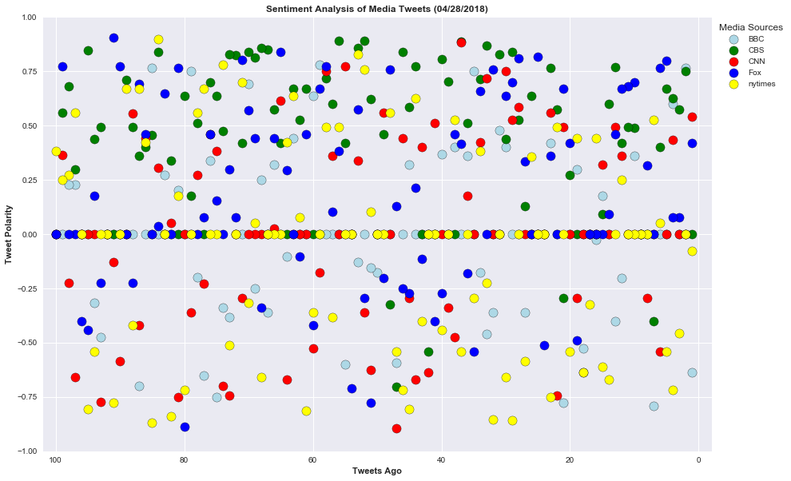
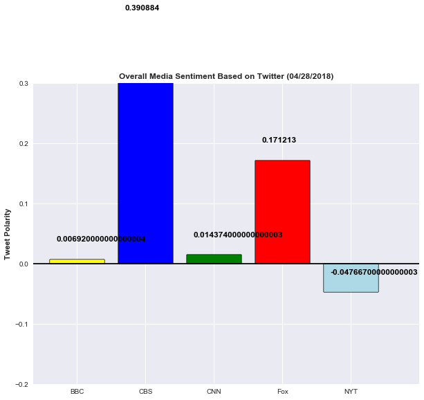

```python
#import all modules 
import tweepy
import json
import time
import pandas as pd
import numpy as np
import seaborn as sns
from datetime import datetime
import matplotlib.pyplot as plt
from vaderSentiment.vaderSentiment import SentimentIntensityAnalyzer
analyzer = SentimentIntensityAnalyzer()
```


```python
#Get all api keys
from config import (consumer_key,
                    consumer_secret,
                    access_token,
                    access_token_secret)

# Setup Tweepy API Authentication
auth = tweepy.OAuthHandler(consumer_key, consumer_secret)
auth.set_access_token(access_token, access_token_secret)
api = tweepy.API(auth, parser=tweepy.parsers.JSONParser())
```


```python
#set up tweepy API Authentication
auth = tweepy.OAuthHandler(consumer_key, consumer_secret)
auth.set_access_token(access_token, access_token_secret)
api= tweepy.API(auth, parser=tweepy.parsers.JSONParser())

```


```python
# Target Search Term
news_outlet = ["@BBC", "@CBS", "@CNN", "@Fox", "@nytimes"]
counter = 1
sentiments =[]
```


```python
for outlet in news_outlet:
    public_tweets = api.user_timeline(outlet, count=100)
    tweetnumber = 1       
    for tweet in public_tweets:
        print("Tweet %s: %s" % (counter, tweet["text"]))
        compound = analyzer.polarity_scores(tweet["text"])["compound"]
        pos = analyzer.polarity_scores(tweet["text"])["pos"]
        neu = analyzer.polarity_scores(tweet["text"])["neu"]
        neg = analyzer.polarity_scores(tweet["text"])["neg"]
        tweets_ago = tweetnumber
        sentiments.append({"Media Source": outlet,
                           "Text":tweet["text"],
                           "Date": tweet["created_at"],
                           "Compound": compound,
                           "Positive": pos,
                           "Neutral": neu,
                           "Negative": neg,
                           "Tweet Count": tweetnumber})
        tweetnumber +=1
        counter +=1
```

    Tweet 1: A crisis of plastic waste in Indonesia has become so acute that the army has been called in to help.
    👉… https://t.co/Qt2S1UlKNf
    Tweet 2: ❤️ This make-up artist is using her skills to help scarred women feel beautiful again. https://t.co/BuQ3vMwtPn
    Tweet 3: The UK's obesity rates have more than trebled in the past 30 years. 
    #BritainsFatFight https://t.co/xE8qL5t1yE
    Tweet 4: 🤖📸 @TWBBC have created a chatbot that can predict how influential your Instagram pictures will be before you post t… https://t.co/lvLPMQ8iyz
    Tweet 5: RT @BBCOne: It turns out Tamsin Greig has had some... sickly... experiences during her time on stage 🤢 #TheGNShow https://t.co/SOfsgk4bre
    Tweet 6: ⚖ BMI and obesity: Where are you on the UK fat scale? 
    
    Try this calculator and see how you compare.
    👉… https://t.co/dHecwNK6uG
    Tweet 7: Palm oil can destroy the habitats of orangutans - and poison your dog. https://t.co/8Pu4OmKRxh
    Tweet 8: 🌈👀 Depending on what language you speak, your eye perceives colours – and the world – differently from someone else… https://t.co/bjyH9RnpP6
    Tweet 9: ⛷🦅 A test of speed and agility.
    #SuperFastFalcon https://t.co/kywvTfrLMw
    Tweet 10: 😕 People are getting surgery to look like their Snapchat selfies...
    
    It’s called ‘Snapchat dysmorphia’ - and it’s o… https://t.co/skDno7F9a1
    Tweet 11: RT @BBCOne: Every, single, week 🤦‍♀️ https://t.co/d15I1CG9Iy
    Tweet 12: This cafe in Greater Manchester only employs former prisoners. https://t.co/7uQhzzVCYm
    Tweet 13: 🎤🎶Absolutely on fire! 🔥
    
    The incredible @JessieJ performs a #GigInAMinute for #SoundsLikeFridayNight 
    
    Watch it in… https://t.co/KAbgQz62te
    Tweet 14: RT @bbcideas: 🥚 Why nursery rhymes aren't always what they seem 🥚https://t.co/UfZnW0AUFG https://t.co/XCQCQBLTPS
    Tweet 15: Take the politics out of it. By the numbers, what would we gain – and lose – if all firearms suddenly were wiped of… https://t.co/byYeF15IeS
    Tweet 16: 🦈 Australian lifeguards are now using drones to help prevent shark attacks. https://t.co/HDvy0MSlVo
    Tweet 17: How does plastic actually enter our oceans? 
    #OurBluePlanet  https://t.co/LdOt9inVFS
    Tweet 18: Record levels of microplastics have been found trapped inside sea ice floating in the Arctic.
    👉… https://t.co/TnDMONKhYD
    Tweet 19: 👏🎶Who will join saxophonist Robert Burton in the 2018 @BBCYoungMus semi-final? 
    
    Watch the brass category final ton… https://t.co/SQwHSnaYmp
    Tweet 20: 🙌🎶 @George_Ezra. @AnneMarie. @NiallOfficial. @CHVRCHES. @Migos.
    
    Tonight's #SoundsLikeFridayNight is going to be HU… https://t.co/13yecJuHFk
    Tweet 21: 💔🐴 Horses are regularly being 'fly-tipped' and left to die by irresponsible owners.
    👉 https://t.co/pTjgWOddaz https://t.co/63k7pzfKmw
    Tweet 22: 🍔 Can lab-grown veggie alternatives wean us off our addiction to red meat?
    👉https://t.co/1ZltVcmg1A https://t.co/XuB6LrEeZH
    Tweet 23: RT @bbcpress: Thank you for the (new) music ABBA! We’ll bring you more info on this announcement in due course… https://t.co/t95MJu68Oa
    Tweet 24: 🍻🐶 How am I supposed to concentrate on what Stevie's saying when there's a dog over there?
    https://t.co/Fu9LaC6WxG
    Tweet 25: RT @BBCNewsEnts: Big news for Abba fans - they've recorded two new songs https://t.co/8AbjhzEbeE
    Tweet 26: Fancy a Cuddle-Me-Buff whilst I razzle this sausage?
    
    These seven old English words deserve to make a comeback.
    👉… https://t.co/7dPSsPsBKW
    Tweet 27: RT @CBeebiesHQ: No detective work needed for this story… 🕵️
    
    Elton John is going to be reading our #BedtimeStory very soon! 📚
    
    @eltonoffici…
    Tweet 28: 💕 Louis Arthur Charles 💕
    
    The Duke and Duchess of Cambridge reveal the name of their new prince.
    👉… https://t.co/EXKxBTaqam
    Tweet 29: 😱😱😱 South Korean boy band @BTS_twt have announced a mammoth world tour which includes two UK dates!!! #BTS
    👉… https://t.co/X6zgjEttlo
    Tweet 30: Do you know how to help a 🐝 in need? https://t.co/FDtmxUkzGS
    Tweet 31: 📸🍎 See the colourful winners of this year's Pink Lady @FoodPhotoAward.
    👉 https://t.co/hLSxgDDeAQ https://t.co/M7AJIhLtVY
    Tweet 32: Tom’s autism means he struggles to identify his own emotions and respond to others’. 
    
    Could a new heartbeat-based… https://t.co/w2CjrJ9P5T
    Tweet 33: The heartbreaking story of the artist who gave the children of this concentration camp art lessons. Their beautiful… https://t.co/gMFqgqgtvg
    Tweet 34: Take a detailed look at ambulance services, from the highly pressurised control rooms to the crews on the street. 🚑… https://t.co/ACZOCRjbgS
    Tweet 35: Follow a young family of falcons as they grow up in downtown Chicago. 🦅
    
    Natural World: Super Fast Falcon | 8pm |… https://t.co/fDzkfaxMNM
    Tweet 36: 😯 This woman from the 1920s looks EXACTLY like Benedict Cumberbatch.  
    #TheGNShow https://t.co/ZkdgiM7ZVg
    Tweet 37: RT @cbbc: If you can't wait to see @iamradzi on this week's ep of #BluePeter, turn him into an alien on the CBBC Buzz app! 📲🖍️➡️ https://t.…
    Tweet 38: 🔥👩‍🚒 These helmets use AR to help firefighters see through smoke. https://t.co/g0807qwa7z
    Tweet 39: RT @bbcpress: Ahead of the final episode of #Civilisations, @Simon_Schama reveals his highlights from the series. Civilisations concludes t…
    Tweet 40: RT @bbcthree: FYI baby Neil from Gavin and Stacey is now a 10-year-old https://t.co/yGthNqOfZK
    Tweet 41: 🍽 Should you become a vegan?
    
    
    Weigh up the pros and cons of meat-eating and veganism. 
    
    🤔
    
    https://t.co/g1xCjnAQFL https://t.co/tzJtDxicA7
    Tweet 42: RT @BBCScotlandNews: Polar bear cub to be named Hamish after public vote https://t.co/HgNRA8gLMu https://t.co/00LK3653xE
    Tweet 43: 🎤Rapper @kanyewest has a way with words. But instead of rap lyrics, these days he’s dropping knowledge on Twitter.… https://t.co/gInfDANKoX
    Tweet 44: 💣🐜 Ever heard of 'exploding ants'? https://t.co/im9JhvRJtS
    Tweet 45: More than 40 companies, who are responsible for over 80% of UK supermarkets' plastic packaging, have signed up to a… https://t.co/Te1iNrkH3D
    Tweet 46: 🦎 Komodo dragons take on prey ten times their size!
    #NaturesBiggestBeasts https://t.co/0WskNgK7aV
    Tweet 47: 🚑 In a medical emergency, the right response can save lives – but many of us are still doing the wrong thing...
    👉… https://t.co/ncRpVF4Ybm
    Tweet 48: 👟🗑 Do you plog? https://t.co/oN1HxQzQJS
    Tweet 49: In 1941, Josef Jakobs was executed at the Tower of London, marking the end of a chapter in its history. https://t.co/q9nwuRjqmv
    Tweet 50: Hugh Fearnley-Whittingstall is on a mission, asking food producers, restaurants and the government to confront Brit… https://t.co/EcfjGY9Hqo
    Tweet 51: ☀️🛶 How an isolated indigenous community in Ecuador is protecting the Amazon jungle with its first solar powered ca… https://t.co/yHNXh2C0ZO
    Tweet 52: 🌱🍓 A man has told of how he 'got his mum back' after a diagnosis of Alzheimer's, in part, by getting her to follow… https://t.co/Bj8a8iAK61
    Tweet 53: ❤️🐿 The dating scene is tough when you're a red squirrel... https://t.co/BUTI5sOp3R
    Tweet 54: 🐧 🤣 When penguins... HONK!... interrupt... HONK!... your TV interview... HONK!   
    #WorldPenguinDay https://t.co/mFUZec36Ne
    Tweet 55: RT @BBCOne: .@HughFW is waging a war on waistlines. Tonight, 9pm, BBC One 🍔
    #BritainsFatFight https://t.co/zYC7BECRw9
    Tweet 56: RT @bbcmusic: OH HI @NiallOfficial 😍 
    
    #SoundsLikeFridayNight https://t.co/Iw2xK5wMj7
    Tweet 57: RT @BBC6Music: "I essentially went to Hogwarts!"
    - @SimonPegg reveals how to have the #BiggestWeekend in his hometown of Gloucester.
    
    🎥 Lis…
    Tweet 58: 🤠 Never turn your back on a man in a cowboy hat. https://t.co/CBkcugUzBO
    Tweet 59: RT @BBCBreakfast: Just look at these gorgeous rescued bear cubs 😍 https://t.co/2wvTLiA01U
    Tweet 60: RT @BBCTwo: This penguin swims thousands of miles every year to visit his best friend... 🐧💙 #WorldPenguinDay https://t.co/JlrMZ5exRE
    Tweet 61: Mums have responded to pictures of the Duchess of Cambridge leaving hospital following the birth of her third child… https://t.co/KQKq2MfdM8
    Tweet 62: 🔥🌶 Some people just can't handle the heat. https://t.co/bcWeeTB8F1
    Tweet 63: RT @TWBBC: We made a chatbot. Our chatbot predicts how influential your Instagram pictures will be before you post them. Our chatbot uses m…
    Tweet 64: 💌 This woman will write you a letter when you're going through hard times. https://t.co/6WejY9BcoI
    Tweet 65: 📚 From ancient epics to modern novels, some narratives have changed history and influenced the mindsets of generati… https://t.co/QDcGy8jwXe
    Tweet 66: These children on Sal Island in Cape Verde are working hard to clean up their beaches. 
    #OurBluePlanet https://t.co/IziZtoSeEp
    Tweet 67: A leading divorce lawyer leaves the family firm for a rival, throwing her relationships into turmoil in the process… https://t.co/AHGrKnYPhA
    Tweet 68: 🐜🤖 By turning ant brains into algorithms, scientists have created robots that navigate without GPS. https://t.co/8qGDjewneC
    Tweet 69: 😲 Australian police say they will review how a 12-year-old boy travelled alone to Bali after he had a row with his… https://t.co/gskGhMaKgN
    Tweet 70: RT @bbcwritersroom: Want to get yr first @BBC writing credit? We're running a #Comedy monologue opportunity alongside @bbcmusic @bbcintrodu…
    Tweet 71: Queen Victoria was sort of the Darth Vader of the British Empire. 
    #CunkOnBritain https://t.co/F4BGHWQtiz
    Tweet 72: RT @BBCOne: When divorce is a family affair... 
    
    #TheSplit. Starts tonight at 9pm on @BBCOne. https://t.co/T31iOt0GIx
    Tweet 73: RT @BBCTwo: The Battle of Trafalgar really slowed down trade at the Pret a Manger. 😂🇬🇧 @missdianemorgan #CunkOnBritain
    https://t.co/5tkFNfD…
    Tweet 74: RT @BBCNews: Gun salute takes place in London for new prince https://t.co/g5AEWrmRec https://t.co/dBoijinHBe
    Tweet 75: 🤢🥚The planet Uranus has clouds made up of hydrogen sulphide, the gas that gives rotten eggs their unpleasant smell,… https://t.co/WWBR6BuUa3
    Tweet 76: 📸❤️ This wedding photo will give you all the feels...
    
    It's by the most committed photographer ever.
    👉… https://t.co/BRtArfWGTM
    Tweet 77: 🐰 When your pet rabbit has got RAGE issues. 
    #NightmarePetsSOS https://t.co/EQF2bAPgIF
    Tweet 78: The faecal transplant, also known as trans-poo-sion, surely has the title of medicine's most disgusting procedure..… https://t.co/433qH3AFV6
    Tweet 79: Cheers! 🍬🍋 Sweet maker Gillian shows @NishaKatona how to make her gin and tonic marshmallows. #TopOfTheShop https://t.co/zLqZBO0Hg0
    Tweet 80: RT @BBCOne: Less than one month to go until the #RoyalWedding!  👰 💑 💍🎉❤️ https://t.co/4tpY4OERd0
    Tweet 81: RT @bbceurovision: "May we have your points please?..." @Rylan prepares the 2018 #Eurovision artists for the all important scoring. 🤣 https…
    Tweet 82: RT @BBCNewsround: Why is Millicent Fawcett getting her own statue in Parliament Square? https://t.co/e6fNQd9ezH https://t.co/y09ruvrxIT
    Tweet 83: RT @BBCLookEast: Well done @simonsmarathon who completed the London Marathon late last night - he is the first man to finish the race using…
    Tweet 84: RT @BBCGetIn: **DEADLINE ALERT**
    
    Just 4 days left to apply for our Communications Trainee Scheme!
    
    Applications close on Thursday 26th Apr…
    Tweet 85: ❤️ This make-up artist is using her skills to help scarred women feel beautiful again. https://t.co/BuQ3vMwtPn
    Tweet 86: 🌈👀 Did you know that depending on what language you speak, your eye perceives colours – and the world – differently… https://t.co/Q6Cn2rteK3
    Tweet 87: ‘I’m determined to prove the terrorists wrong.’
    
    Martin was paralysed in the Manchester Arena attack and is now tra… https://t.co/qTRSdGxBeJ
    Tweet 88: RT @BBCTwo: It's #ShakespearesBirthday so here's Hamlet's famous "To be or not to be" speech, performed by Andrew Scott! 📜🎭🎂 https://t.co/b…
    Tweet 89: 👶💖 The Duke and Duchess of Cambridge introduce their new son to the world. https://t.co/nmrD1axv6Y
    Tweet 90: ✈️ Do you know how to wear an oxygen mask?  https://t.co/pf8lvubtc9
    Tweet 91: RT @BBCBreaking: The Duke and Duchess of Cambridge show off new son outside London hospital https://t.co/lGZ2YAK7um #royalbaby https://t.co…
    Tweet 92: ❤️ The Duke of Cambridge has arrived at hospital with Prince George &amp; Princess Charlotte following birth of their b… https://t.co/w0QF6vPprS
    Tweet 93: 😂 That time the police busted Mary Berry smuggling ingredients into America… 
    #TheGNShow https://t.co/slxL3klU3h
    Tweet 94: How much do you know about England, the English and the frequently odd things they do and eat? Celebrate… https://t.co/zCiIrdYYkW
    Tweet 95: How does plastic actually enter our oceans? 
    #OurBluePlanet  https://t.co/LdOt9inVFS
    Tweet 96: RT @BBCNews: #royalbaby: Formal notice of birth displayed on forecourt of Buckingham Palace https://t.co/jU2MrpGseg https://t.co/wWgoKAeFaJ
    Tweet 97: 🐶❤️ Australian police have praised a dog for remaining with a three-year-old girl as she spent a night lost in bush… https://t.co/oGu1MgHiI0
    Tweet 98: Beth is a trainee nurse about to start working in A&amp;E. 🏥🚑
    
    Can former nurse Una calm her nerves via a hidden earpie… https://t.co/Z1HXesGbkQ
    Tweet 99: 👶❤️ It's a boy! 
    
    The Duchess of Cambridge gives birth to her third child, who is fifth in line to throne. 
    👉… https://t.co/txzbor7jKG
    Tweet 100: Arthur? Albert? Mary? Alice?
    
    As the Duchess of Cambridge goes into labour with her third child, speculation contin… https://t.co/3a65q968kv
    Tweet 101: These stars are going undercover for #CelebrityBoss! Find out more about Celebrity @undercover_cbs premiering May 1… https://t.co/Deyn76ADT9
    Tweet 102: New courage. New hope. New season. 
    
    Season 3 of @CodeBlackCBS premieres TONIGHT at 10/9c on CBS! https://t.co/rR8xUCKlzI
    Tweet 103: Celebrate #DNADay by letting your forensic flag fly and revisit some classic episodes of @CSI_CBS on CBS All Access… https://t.co/YCbHDK2r4b
    Tweet 104: Get ready for big reveals, dramatic conclusions, and huge guest stars! Find out more about the 2017-2018 season fin… https://t.co/xcBChnjEvH
    Tweet 105: Who’s ready to see these moves? 🕺 Tune in to the @latelateshow’s Carpool Karaoke Primetime Special TONIGHT at 10/9c! https://t.co/gjrURqXaPN
    Tweet 106: The 53rd #ACMawards turned into one big party when @KeithUrban and @juliamichaels performed their upbeat single "Co… https://t.co/Q3Zj3EzuNs
    Tweet 107: A blind date was all it took. Learn more about Meghan Markle and her road to royalty from the people who know her b… https://t.co/fEAMUblPQ4
    Tweet 108: RT @carrieunderwood: ICYMI! Watch Carrie’s performance of #CryPretty from the #ACMawards below! -TeamCU https://t.co/T9I3ko2xFu
    Tweet 109: There's a new addition to the cast of the upcoming revival of Murphy Brown!  Learn more about Tyne Daly's character… https://t.co/ijSXSLyDaR
    Tweet 110: Country superstar @LukeBryanOnline delivers his moving anthem "Most People Are Good" at the 53rd #ACMawards:… https://t.co/GhhAsEDqmq
    Tweet 111: Coming to CBS All Access June 14, #StrangeAngel is inspired by the real life story of Jack Parsons and explores the… https://t.co/IsPrXRNXye
    Tweet 112: When you realize there are TWO episodes of @CrimMinds_CBS tonight! 👏 Who’s ready for the double-episode season fina… https://t.co/CWVAHHeIGr
    Tweet 113: Giving you even more reasons to celebrate! 🎉 See which CBS series are back for another year: https://t.co/O2LI0eJXTA https://t.co/H436kL1jSK
    Tweet 114: Watch country star @blakeshelton belt out his beautiful ballad "I Lived It" at the 53rd #AMCawards:… https://t.co/w0WRmpQ6fk
    Tweet 115: RT @joshgroban: I AM SO HAPPY I COULD CRY BUT ITS MIDNIGHT IN JAPAN SO I WILL SLEEP BUT ‼️‼️‼️‼️👫🏆🎭😭🔜 #TonyAwards2018 https://t.co/NLss47K6…
    Tweet 116: Broadway stars @SaraBareilles and @joshgroban will host @TheTonyAwards on June 10! Hear how these multi-talented ar… https://t.co/jy52FKd7t0
    Tweet 117: Can you believe it’s been 11 years since @taylorswift13’s first-ever performance at the #ACMawards?! Look back at t… https://t.co/QHSPuJLLFb
    Tweet 118: Waiting for the @ScorpionCBS season finale to start like… Tune in at 10/9c! https://t.co/peoDXtO707
    Tweet 119: Cast your vote! #ACMawards https://t.co/57ZN5gr6Y1
    Tweet 120: RT @CBSTweet: #CBSRatingsNews: #ACMawards Dominate on #CBS.  Over 12 million Total Viewers.  +11% year to year increase!  Biggest audience…
    Tweet 121: In case you missed it, watch the entire #ACMawards now: https://t.co/P3pgMJE2oh https://t.co/OOG2R0Mb4J
    Tweet 122: Relive a night of all-star country music performances and epic wins at the #ACMawards. Stream the entire show:… https://t.co/iA3SMVIhpA
    Tweet 123: Multiple ACM Award Winners @KeithUrban and @carrieunderwood just added one more trophy to their collection with the… https://t.co/rMGCzOeJQK
    Tweet 124: That's a wrap for the 53rd #ACMawards! 🎬 https://t.co/jM0HKud3d6
    Tweet 125: To all of tonight's nominees, we tip our hats to you! 🤠 #ACMawards https://t.co/eytEezfIgS
    Tweet 126: Retweet if you think @carrieunderwood looks beautiful tonight! #ACMawards https://t.co/sqefiLBcXd
    Tweet 127: In case you missed any, here's a rundown of all the performers from Country Music's Party of the Year®:… https://t.co/KtRKXkUpmI
    Tweet 128: The #ACMawards crowd was roaring for Vocal Event Of The Year winners @KeithUrban and @carrieunderwood! Here is the… https://t.co/rFB5f2lVo7
    Tweet 129: RT @AmberLee_RN: Anyone else crying from that @Jason_Aldean acceptance speech?! Wow! Congrats Jason! #vegasstrong #ACMawards
    Tweet 130: Put your hands up for Entertainer of the Year, @Jason_Aldean! 🙌 #ACMawards https://t.co/QLFrrsyU8R
    Tweet 131: RT @min_d24: Love how @LukeBryanOnline was straight fan girling on @reba and @kelly_clarkson tonight on the #ACMawards! Y'all #killedit
    Tweet 132: Was that "A-sharp" performance by @reba and @kelly_clarkson or what!? 🎼 #ACMawards https://t.co/19pDyrELqC
    Tweet 133: The news keeps getting better and better. @ChrisStapleton deserves a standing ovation tonight! He wins again for Ma… https://t.co/6m7nZFwPyK
    Tweet 134: RT @MattBoveHS: Most People Are Good is such a powerful song #ACMawards @LukeBryanOnline
    Tweet 135: We have our #ACMawards Female Vocalist of the Year: @mirandalambert! 👏 https://t.co/Xu7WPuv1f2
    Tweet 136: Without this talented group of women, @mirandalambert @reba @MarenMorris @KelseaBallerini and @carrieunderwood, lif… https://t.co/Zwqh2PAdM1
    Tweet 137: RT @ElizabethGilbe3: @carrieunderwood never disappoints! What an amazing voice and beautiful soul! #ACMawards #girlcrush
    Tweet 138: RT @SarahJPrimo: I could listen to Dan and Shay all day  #ACMawards
    Tweet 139: RT @MegsMouthful: @carrieunderwood Just WOW. Can’t wait to hear more of your new music! #ACMawards
    Tweet 140: Hugs for @CarrieUnderwood and @KeithUrban's big win for Vocal Event of the Year! #ACMawards https://t.co/nn2XJ6nCSi
    Tweet 141: Always be yourself. Unless you can be @carrieunderwood. Then be Carrie Underwood! #ACMawards #CryPretty https://t.co/32n0QJ1FLD
    Tweet 142: RT @VeldmanKylie: Carrie Underwood gives me chills everytime she performs, she always kills it 🔥❤ #ACMawards
    Tweet 143: Hands up for @littlebigtown at the #ACMawards🙌 https://t.co/o8YFtpGLfK
    Tweet 144: RT @reba: So good to see my friend Eve twice this week! @therealeve @acmawards #acmawards https://t.co/a6LxEaQt8L
    Tweet 145: See all the amazing red carpet looks from the 53rd #ACMawards: https://t.co/ZeZiMXphFK https://t.co/Gi79cuuVPm
    Tweet 146: RT @maddymika_: the ACM awards are the BEST night of the year 😍😍😍❣️❣️❣️ #ACMAwards
    Tweet 147: 🚨 Sound the alarm because @mirandalambert is on FIRE 🔥 at the #ACMawards! https://t.co/11vshBs4EV
    Tweet 148: RT @Skylar_Jean: @mirandalambert can do NO wrong. She is perfection. #ACMawards
    Tweet 149: RT @EmilyyBruorton: @mirandalambert is my all time favorite 🔥#ACMAwards #keeperoftheflame #thebest
    Tweet 150: Hats off to @Jason_Aldean! 🤠 #ACMawards https://t.co/1WSjnafKoX
    Tweet 151: RT @alyssaa711: Country music just brings so much joy to my heart ❤️ #ACMawards
    Tweet 152: She may hate love songs, but @KelseaBallerini knows how to write a great one. 💕 Give her a round of applause for th… https://t.co/r50viWNM0Z
    Tweet 153: The feeling when you win Vocal Group of the Year at the #ACMawards 🎉 Congratulations to @OldDominion! https://t.co/4SjYLtwLXy
    Tweet 154: RT @LouisianaNashie: Way to go Old Dominion #acmawards
    Tweet 155: There's nothing in the world like that performance by @KeithUrban and @juliamichaels. Nicole Kidman agrees!… https://t.co/VlwVUkNZCi
    Tweet 156: RT @AbigailRamage: @reba is slaying the game! Loving her outfits and her puns. She is absolutely stunning!! My all time fave ❤️❤️ #ACMAwards
    Tweet 157: First-ever #ACMAwards winner @BrettYoungMusic stuns the crowd with an incredible performance of his hit, "In Case Y… https://t.co/ftoksP7HrZ
    Tweet 158: RT @tiffstarr16: ACM awards are my favorite time of the year😍 #ACMawards
    Tweet 159: RT @adelleborchetta: Loooove this song!!! @kanebrown and @Lauren_Alaina #WhatIfs #ACMAwards 😍❤️🎉
    Tweet 160: RT @kel_lee213: That Kane Brown performance 😍🤩👏 #kanebrown #whatif #ACMawards #country
    Tweet 161: What if you were made for us, and we were made for you!? ❤️ How much did you love @kanebrown and @Lauren_Alaina's d… https://t.co/xiZQ5wgddc
    Tweet 162: What a performance! @gwenstefani was all smiles when @blakeshelton was on stage. #ACMawards https://t.co/yxbA1DbieE
    Tweet 163: RT @wendyjo3: #ACMawards loved that @blakeshelton performance!!
    Tweet 164: Making her first-ever appearance at the #ACMAwards, @BebeRexha performs her chart-topping collaboration with… https://t.co/u1KXKrCbdD
    Tweet 165: This song by @ladyantebellum sounds like the single for the summer! 🎶 #ACMawards https://t.co/81aj1vqFYh
    Tweet 166: RT @42nagirl: Lady Antebellum is perfection. #ACMawards
    Tweet 167: Hot off the presses! Congratulations on your win and your newborn twins, @ChrisStapleton ! #ACMawards https://t.co/4e9qhxMN69
    Tweet 168: RT @_miracarrara: #ACMawards I am so happy “Tin Man” won song of the year. amazing😍@mirandalambert
    Tweet 169: RT @TheAmelieAnna: Yaaas! @mirandalambert congrats on #Tinman winning! #ACMAwards
    Tweet 170: Congratulations to @mirandalambert for her #ACMawards win for Song of the Year! https://t.co/pucK1Us49R
    Tweet 171: Looks like @BebeRexha and @FLAGALine are “Meant To Be” at the #ACMawards! 🎶 https://t.co/0RvqyJ9geh
    Tweet 172: RT @AlliCat028: Loving the show so far. @ChrisYoungMusic rocked it and of course @reba is perfect. @ACMawards #ACMAwards
    Tweet 173: RT if you loved that amazing performance of “Rich” by @MarenMorris 💸 #ACMawards https://t.co/3FeWpdOSl6
    Tweet 174: Give a round of applause for the #ACMawards host, @reba! 👏 https://t.co/ilIBWn6VIn
    Tweet 175: RT @JustinPlummer15: Laid up in bed with my dog watching the #ACMAwards is the best way to spend Sunday night 👌🏻
    Tweet 176: Get ready to see your favorite country stars light up the night. The #ACMawards start NOW! https://t.co/SCf66kSWxT
    Tweet 177: Kick your boots off and stream the 53rd #ACMawards in 30 minutes on CBS All Access: https://t.co/sdTTidJYre https://t.co/pyi23nBPSH
    Tweet 178: Tonight's the night! Tune in at 8/7c to see @reba and all your favorite country artists take Vegas by storm at the… https://t.co/UlPpES5eN8
    Tweet 179: The anticipation is real. Just three hours away from the 53rd #ACMawards! Tune in at 8/7c on CBS All Access:… https://t.co/9os3PJ4pyQ
    Tweet 180: Are you ready to party with @dariusrucker in a few hours at the #ACMawards? Watch the show LIVE at 8/7c on CBS, or… https://t.co/xAGKgZFRoD
    Tweet 181: Look out for @LukeBryanOnline's performance tonight at the 53rd #ACMawards! https://t.co/dgxgsfj5Hg
    Tweet 182: Are you as excited for the #ACMawards as @KelseaBallerini? This Female Vocalist Of The Year nominee is taking the s… https://t.co/JSj5jGH25H
    Tweet 183: Watch @Jason_Aldean and @ThomasRhett take a break from rehearsals to spend quality time with Route 91 Survivors.… https://t.co/TiDfaYxJUm
    Tweet 184: Country's brightest stars like @ThomasRhett are ready to pour their hearts out during their performances tomorrow n… https://t.co/m3zOG8M8lw
    Tweet 185: You’re invited to Country Music's Party of the Year®! Here's everything you need to know before watching the 53rd… https://t.co/Xr4iamFD7t
    Tweet 186: Get excited! @NCIS_CBS has been renewed for Season 16. https://t.co/JnL0D0vMsV
    Tweet 187: What goes into putting on an extraordinary show like the 53rd #ACMawards? Head behind the scenes with the executive… https://t.co/2sFRfYNAku
    Tweet 188: Enjoy this #FlashbackFriday revisiting @ThomasRhett @KaceyMusgraves and more of country's biggest names for their f… https://t.co/cnCQBnP1xI
    Tweet 189: Host of the 53rd #ACMawards @reba is ready for "family, friends, and getting together" this Sunday! https://t.co/y25ZipnL32
    Tweet 190: It's almost time for Broadway's Biggest Night! @katharinemcphee and @leslieodomjr are set to announce nominations f… https://t.co/oHbuSD5ijc
    Tweet 191: In two days, Vocal Group Of The Year nominee @ladyantebellum will be serenading fans from the 53rd #ACMawards stage… https://t.co/ku9cnef29x
    Tweet 192: In just a few days, country superstar @KeithUrban will take center stage with @juliamichaels to perform his new sin… https://t.co/he6TsePMgA
    Tweet 193: Country star @MarenMorris lit up the stage in honor of @eltonofficial and she's about to belt it out again at the 5… https://t.co/OkGaL9MlB2
    Tweet 194: Comedian, actor, and global superstar @KevinHart4real will host CBS’ new TV competition TKO: TOTAL KNOCK OUT! Learn… https://t.co/0XfMAoakDM
    Tweet 195: You may be surprised to learn some of your favorite TV stars have deep southern roots and a love for country music.… https://t.co/rCoNVI0qeT
    Tweet 196: RT @TheTalkCBS: WATCH: @Reba McEntire AND @kelly_clarkson will be singing a duet together at the #ACMs! Check out which song they chose 👍 h…
    Tweet 197: This Sunday night, @carrieunderwood will be taking the stage to share her soon-to-be-released single live at the 53… https://t.co/NRS6RAaKZK
    Tweet 198: Pets—you can't help but love 'em! Celebrate #NationalPetDay with more sweet, unexpected moments between Frasier and… https://t.co/o4gNRN42su
    Tweet 199: Today, 53rd #ACMawards host @reba will be answering fan questions when she takes to Facebook Live. Be sure to tune… https://t.co/vsSjAPFW1Z
    Tweet 200: Country stars @JonPardi, @OfficialJackson, and more to perform "ACM Flashbacks" at the 53rd #ACMawards. Learn more… https://t.co/z2KEo3PVUN
    Tweet 201: RT @CNNPolitics: President Trump attacks Democrats at the rally: “The Democrats don’t care about our military ... they don’t care about our…
    Tweet 202: The crowd in Washington Township, Michigan, chants "Nobel! Nobel!" as President Trump talks North Korea… https://t.co/qPS4cnChG2
    Tweet 203: President Trump started his rally in Michigan with a jab at the White House Correspondents' Dinner: "I'd rather be… https://t.co/42suPwG9x5
    Tweet 204: President Trump speaks at a rally in Michigan: “We need to elect more Republicans so we can protect our cities, def… https://t.co/hVT6m8l0W0
    Tweet 205: RT @CNNPolitics: Former White House economic adviser Gary Cohn at the White House Correspondents’ Dinner: “Freedom of the press is very imp…
    Tweet 206: Larry Harvey, the founder of the Burning Man festival now held in Nevada, has died at age 70 after suffering a stro… https://t.co/FuL6HCtoE0
    Tweet 207: President Trump speaks in Washington Township, Michigan. https://t.co/UYpqI3w42L
    
    Watch on Facebook:… https://t.co/ZjWccYtjb5
    Tweet 208: Bill Cosby prosecutor "filled with awe" after his guilty verdict https://t.co/HXgMtbkF22 https://t.co/UsFxnGeDAt
    Tweet 209: President Trump is skipping tonight's annual White House correspondents' dinner to hold a campaign rally in Michiga… https://t.co/fxwpDSzkkn
    Tweet 210: President Trump is holding a campaign-style rally in Washington Township, Michigan. Follow live updates:… https://t.co/93luKEW5RT
    Tweet 211: President Trump is skipping the White House correspondents' dinner for the second year in a row. Follow live update… https://t.co/mg4u9Fk0cr
    Tweet 212: White House press secretary Sarah Sanders says President Trump encouraged his staff to attend this year's correspon… https://t.co/fWR05TuG2G
    Tweet 213: Seattle Seahawks draft a player with one hand, the first in modern NFL history https://t.co/GGyUneemM8 https://t.co/nAmkAvcQxk
    Tweet 214: CNN's Brian Stelter says dozens of White House officals attending the Correspondents' Dinner "shows how hollow the… https://t.co/vXjozorGTz
    Tweet 215: Jean-Eric Vergne claims an emotional victory in his home city of Paris to extend his title lead in the Formula E ch… https://t.co/7vfgtWkPil
    Tweet 216: CNN's Dianne Gallagher reports that a big crowd of people is lined up waiting to attend a Trump rally in Michigan.… https://t.co/vcf8G8SyvL
    Tweet 217: Largest child sacrifice in history discovered in Peru https://t.co/F6JCXFLqga https://t.co/AMp8qB0w9A
    Tweet 218: "The President is known to go in all sorts of directions at these rallies. ... he's among his supporters." CNN's Bo… https://t.co/KiBd3ij56I
    Tweet 219: Democrats need to stop believing this myth about Trump's base https://t.co/9pnZ8nW2te (via @CNNOpinion) https://t.co/8TYAwvpJWs
    Tweet 220: Former White House press secretary Sean Spicer arrives on the red carpet of the White House Correspondents' Dinner.… https://t.co/Y26NWl3MDj
    Tweet 221: Alfie's Army rallies behind his family and releases balloons in his honor https://t.co/S2lrmgGwDq https://t.co/wgwohD5XZT
    Tweet 222: Thousands protest after men are cleared of rape in Spain's "wolf pack" case https://t.co/pk0Lcaa4WV https://t.co/3xdwBoqpPe
    Tweet 223: Joy Reid apologizes and says experts haven't proven she was hacked https://t.co/AuWUmc769z https://t.co/fKTdJtR6yp
    Tweet 224: British supermarket chain Sainsbury's in "advanced" merger talks with Walmart's Asda https://t.co/qFGHFsnda1 https://t.co/kk8MNJm212
    Tweet 225: President Trump to skip White House Correspondents' Dinner for Michigan rally https://t.co/PcCNRpqnGh https://t.co/OgmRtq8l80
    Tweet 226: President Trump may have just had a breakthrough, writes Frida Ghitis for @CNNOpinion https://t.co/eXXqkgZ1jr https://t.co/odHr6m14yU
    Tweet 227: What to expect at the White House Correspondents' dinner https://t.co/7cpfigUXYM https://t.co/rAzCEqJOu7
    Tweet 228: Veterans' grass-roots movement shares health benefits of marijuana https://t.co/ASR2JEfHXL https://t.co/g2obaa6tAS
    Tweet 229: North Korean state media praises "historic" Kim-Moon summit https://t.co/yoEiSPqb7J https://t.co/vAkN23ucHn
    Tweet 230: South Koreans dare to hope of once unthinkable peace with North Korean leader Kim Jong Un https://t.co/IQZjkgkyFd https://t.co/Yf0AtCoWZw
    Tweet 231: Texas voter ID law can go into effect, appeals court panel rules https://t.co/KUMDKOEA0I https://t.co/HO460OF9o4
    Tweet 232: This bill could weaken the protection of a credit freeze https://t.co/mmVkY9BttT https://t.co/KDVxAnSYQO
    Tweet 233: China and India agree to maintain border peace, as summit ends https://t.co/mbe9FCpyAc https://t.co/13e9MUtA2v
    Tweet 234: Australian Olympian Peter Norman honored over 1968 black power protest https://t.co/Am7VJfOwCS https://t.co/rj0fzhzawB
    Tweet 235: Who is Meghan Markle's future husband? https://t.co/xrBmz2CcXG https://t.co/Eg76r4rwnl
    Tweet 236: Everything Amazon has added to Prime over the years https://t.co/9hB9XzHbLG https://t.co/yDYCJrI2z8
    Tweet 237: New Orleans residents share their pride and passion for their home as the city celebrates its 300th anniversary… https://t.co/UfCy8h12Di
    Tweet 238: White House shows documents to defend Dr. Ronny Jackson on car accident, some questions over pills… https://t.co/5c3ChCSNym
    Tweet 239: President Trump calls for Democratic Sen. Jon Tester to resign over his opposition to White House physician Ronny J… https://t.co/ZJhmRN8aAc
    Tweet 240: The Gaia satellite gave us a new star map that is out of this world https://t.co/AF3vhrj9jy (via @CNNOpinion) https://t.co/7t7pSfFiFe
    Tweet 241: Liberian ex-President Ellen Johnson Sirleaf dedicates $5M prize to women's empowerment https://t.co/Z1FxeTtMCz https://t.co/C7PSeLQaXL
    Tweet 242: Judge in case Jeff Sessions picked for immigrant domestic violence asylum review issued "clearly erroneous" decisio… https://t.co/iCPBhArGFZ
    Tweet 243: British toddler Alfie Evans dies after life support is withdrawn https://t.co/kWyjArvwSW https://t.co/aivTfu5iCV
    Tweet 244: Military officials killed in Somalia restaurant blast https://t.co/eX3me7Hdx4 https://t.co/R8s04UZkvK
    Tweet 245: Here's what you missed during a busy news week https://t.co/rsVrBe1WFd https://t.co/AaO16FxKqY
    Tweet 246: Defense Secretary James Mattis woos National Security Advisor John Bolton with breakfast club invite… https://t.co/1LDQiN4soe
    Tweet 247: Soldiers among 6 killed in Afghanistan car bomb attack https://t.co/GMsLhU1UE9 https://t.co/tEGfMBMEvl
    Tweet 248: President Trump and South Korean President Moon talk ahead of North Korea meeting https://t.co/t6LGP10E07 https://t.co/HjO4dSX67p
    Tweet 249: Kanye West just released a new song defending his praise for Trump. The track features West debating with Tip "T.I.… https://t.co/asge9HLqNw
    Tweet 250: 3000 miles. Sickness. Trains of trash. A 27-year-old pregnant mother of two recounts fleeing from Honduras alongsid… https://t.co/wzULYjTADs
    Tweet 251: These kids were being bullied. Then a photographer transformed them into Avengers superheroes… https://t.co/oRtaz9zecY
    Tweet 252: Here's how far teacher salaries have fallen behind https://t.co/6XtGE8D2nK https://t.co/hcdGo2sAPZ
    Tweet 253: Amazon is raising the price of Amazon Prime from $99 to $119 per year https://t.co/N0DpVCku8I https://t.co/84REwojwf9
    Tweet 254: Sweden has opened the world's first public road that allows electric cars to recharge while driving… https://t.co/Rfw1DgEHKD
    Tweet 255: The super groovy talent behind "Schoolhouse Rock" | By Gene Seymour via @CNNOpinion https://t.co/8P3O7IDmnH https://t.co/rTKmd9z58Q
    Tweet 256: As the world's most populous nation, with the second-biggest economy, China is finding new and increasingly nerve-r… https://t.co/lfY9olJ3FX
    Tweet 257: Get ready for the world's longest nonstop flight: Almost 20 hours https://t.co/ILyfh70lqm https://t.co/e8HtT9SZXf
    Tweet 258: "Hannity is a very wealthy man. So is Donald Trump. It appears that part of the way they became rich was by decryin… https://t.co/tZ5M9pVhL9
    Tweet 259: These mysterious Arctic ice holes have NASA scientists puzzled https://t.co/EX5e9ACPux https://t.co/93xOfQRUqP
    Tweet 260: A man was threatening to jump off an overpass so these truckers parked underneath to break his fall… https://t.co/gMe3YRDj4A
    Tweet 261: Nickelodeon is bringing back 'Double Dare' https://t.co/hJqRcKg93b https://t.co/Xkj4pEPnWO
    Tweet 262: Walmart's CEO earns 1,188 times as much as the company's median worker https://t.co/EfQG8ccR3e https://t.co/Ihk2Ta8Rju
    Tweet 263: The hands did the talking during Macron's visit | GIF analysis by Brenna Williams https://t.co/sNMkmqz3Sx https://t.co/pt9qgW5ko9
    Tweet 264: Fakhir Berwari disarmed thousands of mines in northern Iraq from 2003 until an improvised explosive device killed h… https://t.co/Ye5yQUIzdS
    Tweet 265: A study says it takes about 50 hours with someone before you consider them a casual friend -- and 200 before you ac… https://t.co/eMOqOmjF89
    Tweet 266: After an argument with his mom, this 12-year-old boy used his mom's credit card and flew to Bali on his own… https://t.co/D1nKqPmrhc
    Tweet 267: For Jessica Nabongo, becoming the first black woman to visit every country on Earth isn't just about getting her na… https://t.co/txxkotHPj2
    Tweet 268: Former President Obama will deliver a high-profile address in July marking the 100th anniversary of Nelson Mandela'… https://t.co/p6nbLqCHWp
    Tweet 269: Colin Jost and Michael Che, anchors of "Weekend Update" on "SNL," will co-host this year's Emmy Awards… https://t.co/hzkZFe2HlH
    Tweet 270: These are some of the most exquisite libraries in the world https://t.co/0wtZCbCJgV https://t.co/gi0GUYc75V
    Tweet 271: Mamma Mia, here they go again -- Swedish pop group ABBA is back with new music https://t.co/HUT2Rm829u https://t.co/fOxtzv4HDr
    Tweet 272: Meet the new Gmail, now with disappearing messages https://t.co/Ksi3MlFdNJ https://t.co/FrbxXGAutx
    Tweet 273: It took a devastating earthquake and ensuing tsunami to transform Misaki Tanaka's view of disaster relief and inspi… https://t.co/8MGqeZbKwS
    Tweet 274: Australia's forgotten indigenous World War II veterans https://t.co/SdBpb0LL6Y https://t.co/2uZd6HIQOY
    Tweet 275: You can now set your Gmail messages to expire or protect them with a passcode https://t.co/aOxy8GBHAR https://t.co/Q9TSfp3pUz
    Tweet 276: NASA is going to Mars again, this time with the first spaceship dedicated to digging deep below the surface to find… https://t.co/uIH7xsWR2v
    Tweet 277: Orange is comforting. 
    Pink makes us less violent. 
    
    The psychology of color: https://t.co/FMeiwT4rwA https://t.co/lfsHdeHxzI
    Tweet 278: A young US serviceman injured in Afghanistan was the recipient of the world's first successful total penis and scro… https://t.co/oFMuRbK1Xb
    Tweet 279: Nickelodeon is reviving trivia game show "Double Dare" for a new generation of kids to compete in messy physical ch… https://t.co/sCERaakGAi
    Tweet 280: While this teacher was working her second job as a cashier, a customer slipped her an envelope. When she opened it,… https://t.co/HpzJ7XyrFd
    Tweet 281: Fearing that climate change is hurting their sport, Winter Olympians take on politics https://t.co/9eEe59WpGx https://t.co/ZfBdTgcZBZ
    Tweet 282: Exposure to the kind of blue light emitted by outdoor LEDs, smartphones and tablets may increase your risk of breas… https://t.co/JQ2FYeaqWE
    Tweet 283: History was made Friday when Kim Jong Un became the first North Korean leader to cross into South Korean territory… https://t.co/wQ0jonYk04
    Tweet 284: EXCLUSIVE: The NRA is setting aside years of documents regarding its ties to a Kremlin-linked banker… https://t.co/xhs1JS1TjY
    Tweet 285: Arizona's only two black state legislators were publicly rebuked after they expressed concern over a colleague usin… https://t.co/Oex3COW0wn
    Tweet 286: FIFA directed attention to the organization's ethics rules following President Donald Trump's tweet supporting the… https://t.co/thSjy2uSh1
    Tweet 287: This award-winning photo of an anteater creeping toward a glowing termite mound was disqualified after judges concl… https://t.co/my31vI7spK
    Tweet 288: RT @AC360: "With little to no money or food, she has tried to protect them [her children], in search of a better life." - CNN's @leylasanti…
    Tweet 289: Gabriela Hernandez, who is pregnant, and her two boys joined the "migrant caravan" of travelers across Mexico towar… https://t.co/w69CpWBrqg
    Tweet 290: These are the people our nonsense US border policy ignores | By @wkamaubell via @CNNOpinion https://t.co/HziZuiIh6w https://t.co/afeZDzfhun
    Tweet 291: "We're stronger together": After a football accident, doctors told him he'd never walk again. Seven years later, hi… https://t.co/KVxRZQ3rpo
    Tweet 292: A main proponent of the Russia sanctions law known as the Magnitsky Act says Natalia Veselnitskaya, the Russian law… https://t.co/PuKOUHKaWD
    Tweet 293: An investigation into the death of a mentally ill man who was repeatedly tased in his shower by two West Milwaukee… https://t.co/2R2uyUZE9e
    Tweet 294: This Donald Trump answer on Russian collusion is a real doozy | Analysis by @CillizzaCNN https://t.co/yZS5aUUHyG https://t.co/bJvExMfwcQ
    Tweet 295: Hush money deals are business as usual for Stormy Daniels' ex-attorney https://t.co/lXlEkqzseG https://t.co/ILlawTiilb
    Tweet 296: The Nevada Senate race shows that demographics are not destiny | Analysis by CNN's Harry Enten… https://t.co/UhMAJlfxtQ
    Tweet 297: All 10 victims of the Toronto van attack have been identified https://t.co/oE3zD2fLJQ https://t.co/QjLUniozNt
    Tweet 298: Rabbis want Kansas state Sen. Steve Fitzgerald to stop citing the Nazis and Holocaust in his anti-abortion argument… https://t.co/QZbRxi3woV
    Tweet 299: RT @AC360: "It's almost laughable, except it's not, that invoking fairness and remembering those less fortunate, apparently is now a firing…
    Tweet 300: A Republican candidate in the Georgia gubernatorial race appears to have cribbed language from Missouri Gov. Eric G… https://t.co/zMnmoq2caD
    Tweet 301: @borisschapira thank you, Boris! 💐
    Tweet 302: RT @roaringsoftly: ✨ Work-From-Home L👀ks ✨ https://t.co/xfVPkK648N
    Tweet 303: @notwaldorf @sailorhg I guess I need to find an excuse to come to SF to take a selfie with you two 🌸❤️💇🏻‍♀️
    Tweet 304: Representation matters. Representation matters. Representation matters. Representation matt...
    Tweet 305: RT @triketora: love that there is a technical discussion of how to represent skin tone in this piece. good to shed some light on what it ac…
    Tweet 306: @sailorhg Omg you look fabulous! I just did my hair the same way, funnily enough. 😂💇🏻‍♀️👌🏻
    Tweet 307: Resources on conference organizing, written and curated by @fromthefront team (including a few guidelines on inclus… https://t.co/6HejWwb5mO
    Tweet 308: @callmevlad I’m just going through “Start with Why”. So far it’s really good! Don’t know how I missed his writing before 😇
    Tweet 309: “People don’t buy WHAT you do, they buy WHY you do it.”
    
    —Simon Sinek
    Tweet 310: @patrickbjohnson Thank you! I haven’t read them :)
    Tweet 311: @patrickbjohnson My reading list is largely focused on feminism :) https://t.co/czMqsKsRao
    Tweet 312: I’ve recently ordered ten books and can’t wait to read them. First ones started to arrive already! (endless love to… https://t.co/4aU5lGT9Un
    Tweet 313: RT @jsconfeu: 🖼 Have you ever wondered how attending JSConf EU might feel like?
    📸 Here is a exclusive look at pictures taken at our 2017 ev…
    Tweet 314: .@rails updates their illustrations to be more inclusive. 
    
    Representation matters. 👏🏻
    
    https://t.co/9rWIsuNuzC
    Tweet 315: @MinaMarkham 😱👏🏻👯‍♀️
    Tweet 316: Patreon’s Diversity and Inclusion report is out! Above average statistics and actionable strategies. 👏🏻
    
    https://t.co/u3MiYPVCoh
    Tweet 317: RT @fleurchild: You don't have to be a visible or well-known community organizer or activist to deserve a break from burnout and time/space…
    Tweet 318: Internet abuse has real repercussions. After my last inclusion callout that went viral I had to schedule an emergen… https://t.co/yrftQdu5ow
    Tweet 319: @justkelly_ok I just read her book and it hit home so close. :( I was gutted to see she’s not here to follow anymore.
    Tweet 320: @adblanche Thank you, Aubrey! 🌸
    Tweet 321: @polotek Thank you! I appreciate it.
    Tweet 322: RT @soniagupta504: Enough with the white dudes who "well, actually" POC when we talk about race based on our experience, and men in general…
    Tweet 323: @patriciarealini ❤️❤️❤️
    
    I might take you up on this soon (when I don’t feel like dying on the inside anymore).
    Tweet 324: RT @MsPackyetti: This isn’t about “free thinkers,” yo. 
    
    White Supremacy kills people. The rhetoric of this election cycle left people hurt…
    Tweet 325: @evanderkoogh thank you, Erwin! I appreciate your support!
    Tweet 326: @patriciarealini I feel so seen now
    Tweet 327: RT @patriciarealini: it's so important to remember that this work isn't a marathon bc the distance we need to travel is too far to go alone…
    Tweet 328: RT @patriciarealini: this is why it is SO important to respect URMs when they disengage.
    
    no one is entitled to the emotional labor of othe…
    Tweet 329: @patriciarealini I wish I realised the impact before I burned out, lolsob. Very true.
    Tweet 330: I love my neighbouring coffee shop for this peanut butter milkshake and also blasting Jungle so I can sing-along while I write.
    
    ✌️
    Tweet 331: @DajanaGuenther 💞
    Tweet 332: @DuchessFounder thank you! it’s delicious. 😋
    Tweet 333: And now I am going to get a milkshake.
    
    🍹
    Tweet 334: I have very little energy left in me, but I will continue pushing my projects forward.
    
    Thanks to my Patreon, this… https://t.co/qZlJnn0j5t
    Tweet 335: Support people who are fighting against injustice. If you don’t have the monetary means to do so, send them a kind… https://t.co/UBSbVaNdNj
    Tweet 336: I have much more to say about this, but I don’t have the mental capacity to go into the details today. So I will leave you with this...
    Tweet 337: However, there are limits. Everyone I know in the D&amp;I space is exhausted. We’re burning through SO MANY talented pe… https://t.co/EMJOkcj35Y
    Tweet 338: I can’t forfeit my values and want to continue speaking up for URMs and implementing quantifiable strategies to mak… https://t.co/qk1LAOaJVr
    Tweet 339: RT @brsabel: Diversity is more than gender. Diversity is more than gender. Diversity is more than gender. Diversity is more than gender. Di…
    Tweet 340: Somehow within the last two years inclusion activism became my 24/7 (mostly unpaid) job.
    
    I’ve underestimated the e… https://t.co/oNtS77k8jb
    Tweet 341: RT @juliaferraioli: It's no good fighting to survive if you forget how to live.
    Tweet 342: @_sagesharp_ This book has been life-changing for me. https://t.co/qCmOkHUg5k
    Tweet 343: RT @EricaJoy: I don't want to hear about diversity numbers, unless you're talking about promotion, retention, &amp; equity. I don't want to hea…
    Tweet 344: A nice roundup of inclusive product design practices. I’d add web performance; an often overlooked but crucial aspe… https://t.co/fly0FTIEQk
    Tweet 345: RT @juliaferraioli: Software engineering, a story.
    
    Year 1: The build system does WHAT?
    Year 3: This problem requires careful thought and a…
    Tweet 346: @ashedryden Evergreen mood, sob.
    Tweet 347: Sometimes Instagram ads are useful. 
    
    Accidentally, I found this blog, mostly focusing on sustainability and consci… https://t.co/o4cHogzWbn
    Tweet 348: A lovely article on the pros and cons of public speaking (with a hilarious illustration) by @lynnandtonic. 👏🏻 https://t.co/yxDCNKArZm
    Tweet 349: @amyngyn It’s at the end of the page: https://t.co/zof0jZVBor :)
    
    Sadly, I didn’t copy my Lanyard page, sob.
    Tweet 350: RT @laura: Last night, I met a young black developer who had been in Silicon Valley a few months. 
    
    When asked how he chose his job, he rep…
    Tweet 351: If anything, white men need more discomfort and understanding injustice that’s faced by underrepresented, not more… https://t.co/SLGBG7ocbP
    Tweet 352: RT @ScribblingOn: Hey, you, stop for a moment and think about where you wanted to be 4 years ago and where you're now. Give yourself credit…
    Tweet 353: It only took me a few hours to read Lindy Wests’ “Shrill”—an excellent book on feminism, fatphobia, Internet trolls… https://t.co/whBcHYrRbf
    Tweet 354: This is racism at work. Making righteous citizens fear for their life for giving spare change to a homeless person.… https://t.co/YS1UduJ2Z0
    Tweet 355: RT @aprilwensel: 📝 New blog post! “It’s Time to Retire ‘RTFM’” https://t.co/dHpwjdMXND https://t.co/9dfRyvqGSg
    Tweet 356: @javve It’s for growth hacking Jonny
    Tweet 357: RT @PRADACCIA: Things women shouldn’t have to apologize for:
    
    1. Having our periods.
    2. Sexual preference.
    3. Putting work first.
    4. Bra cu…
    Tweet 358: RT @Blackamazon: Everybody loves a meritocracy till the weird black girl has more merit than they do .
    Tweet 359: @rubencodes @laurawp I have been talking to a lot of organisations lately + browsing career pages and so far best e… https://t.co/vPuzr6O7jG
    Tweet 360: RT @varjmes: we tried! no women applied! https://t.co/NLTdSOn1dT
    Tweet 361: @DevelopSean Currently, “Shrill” by Lindy West. :) https://t.co/FK8DWYN70u
    Tweet 362: @clewishalpern @rubencodes @susanthesquark @sehurlburt @anildash @Ana_M_Medina @tiffani @laurawp 5) pay attention t… https://t.co/APnjOPQYzq
    Tweet 363: @clewishalpern @rubencodes @susanthesquark @sehurlburt @anildash @Ana_M_Medina @tiffani @laurawp 1) ask for numbers… https://t.co/xEbhFzihqI
    Tweet 364: RT @patriciarealini: If you're itching for more, please watch the talk I gave @JSConfAU last month on unconscious bias, stereotypes, and in…
    Tweet 365: I missed this before, but it’s a fantastic recap of @juniordev_io meetups—accountability, tracking progress and cel… https://t.co/iftycJMPsZ
    Tweet 366: @happycrappie Funny you say that, he actually sit on the bath edge and stared at me. 😂
    Tweet 367: The @levelsconf tweets are just pure gold, I’m telling you.
    
    https://t.co/0Fs5f4W8Xc
    Tweet 368: @ameliaabreu Indeed, I find design conferences being bigger offenders than engineering ones. Sigh.
    Tweet 369: @Amys_Kapers Add cheese and biscuits and everything is suddenly better. 😂
    Tweet 370: @madalynrose Looking fabulous!
    Tweet 371: @mjmichellekim Yes, I’d love to! I’ll email you. 🌸
    Tweet 372: @mjmichellekim I want to be in this workshop.
    Tweet 373: @sergeyche I’m working on a more extensive resource (think ebook, online resources and a checklist). I share update… https://t.co/Qx4wUfX6p6
    Tweet 374: @jsalli39 There is a way of doing it inclusively. Be transparent that e.g. 50% comes from CFP &amp; 50% is invited so p… https://t.co/nRl65lQBHl
    Tweet 375: @jsalli39 Often events invite “famous” speakers to drive ticket sales. Often they do so before a call for speakers… https://t.co/QKtAFtPTxs
    Tweet 376: @sergeyche I’m working on one. :)
    Tweet 377: I want to quote this entire book. (“Shrill”)
    Tweet 378: “Privilege means that those of us who need it least often get most help.”
    
    —Lindy West
    Tweet 379: “Society’s monomaniacal fixation on female thinness isn’t a distant abstraction, it’s a constant, pervasive taint t… https://t.co/CQai4XJjWI
    Tweet 380: RT @gothforbid: woman: i experienced this thing
    man: ok but i, as a man, did not experience this so you're either lying or lying
    Tweet 381: @maxvoltar Well, it’s not IN the bath, technically. Bath caddies! Living my best adult life.
    Tweet 382: RT @janeruffino: Anyway, “disruption” is too often a code word for “deliberately ahistorical and decontextualized from local and human know…
    Tweet 383: @janeruffino I just wanted to say that your new profile photo is outstanding! 💐
    Tweet 384: @butwhoiskat never leave the house
    Tweet 385: I’m hosting my own tech meetup, it’s called being in a bath with a book, candles, tea and a cheese platter. 
    
    💁🏻‍♀️
    Tweet 386: @amyngyn One of the reasons why I don’t submit to some performance conferences; always the same faces and it’s obvious I wouldn’t get in. :)
    Tweet 387: Another good read on the proactive nature of having an inclusion strategy in event organising.
    
    👏🏻 @RosenfeldMedia… https://t.co/xa4xDZx21I
    Tweet 388: @FCTweedie Not covering travel will exclude most of the underrepresented groups, unless they’re local. It does have… https://t.co/CocF4AkanI
    Tweet 389: @FCTweedie I’ve spoken at an event where I paid for my travel but I wouldn’t do it again. 
    
    Only locals or a privil… https://t.co/3Gp8r5yGSl
    Tweet 390: @Lady_Ada_King I have tried my best, thank you. 😂
    Tweet 391: @annie_parker Yep, share away, credit is appreciated. :)
    Tweet 392: @editingemily 💁🏻‍♀️
    Tweet 393: Here’s my gift to event-goers and organisers: Conference Diversity and Inclusion Bullshit Bingo.
    
    (Note that the fo… https://t.co/9uPlIdw5J6
    Tweet 394: I’m also tired of “please teach us for free, it’s your responsibility to educate!” approach.
    
    It’s the never the jo… https://t.co/6ClLycyVSt
    Tweet 395: RT @EricaJoy: I'm tired of having Diversity and Inclusion 101 conversations. The reading is out there. The countless talks and panels are o…
    Tweet 396: I’d love to use @Pinterest more, but I find it quite frustrating that the process of adding something via the Chrom… https://t.co/lto1byUqFD
    Tweet 397: RT @nmsanchez: Companies, asking for advice: "How can we tell if our diversity and inclusion programs are working?"
    
    Me, an expert: "Find o…
    Tweet 398: @jennwrites masculinity, so fragile from the very beginning
    Tweet 399: RT @NatDudley: Tech peeps: hmu with conferences that might be interested in a talk on how we can build better account creation flows using…
    Tweet 400: RT @levelsconf: 💥Apocalypse
    ☄️Catastrophe 
    🔥Armageddon
    😱Final countdown 
    😵End of Days
    
    Or in the world of https://t.co/4zs2DZHFO4
    
    ⚡️LAST D…
    Tweet 401: A young soldier whose genitals were destroyed underwent extensive reconstructive surgery that doctors hope to offer… https://t.co/SaLtBwQOZC
    Tweet 402: Fiction: Familiar Tales Remixed, at the Hands of a Postmodern Master https://t.co/rRmz164yGR
    Tweet 403: A scientist spent years studying a gene. Then she had a baby with an extremely rare disorder tied to it. https://t.co/CyWpqgcJDa
    Tweet 404: Archaeologists in Sweden found victims of a 5th-century massacre where attackers used swords, axes and clubs to but… https://t.co/YhAq86eljs
    Tweet 405: RT @nytimesworld: "I believe Irish society is starting to listen to the voices and needs of women and ignore the propaganda pumped into us…
    Tweet 406: "It was only after the adrenaline and tension began to ease toward the end of the day that I realized we had assemb… https://t.co/nQo4C6LD15
    Tweet 407: For 2 people immersed in social justice and antiwar work, where everything seems to happen at a glacial pace, love… https://t.co/NlcdDlDjIJ
    Tweet 408: Stars Remember the Golden Age of New York Theater https://t.co/6nR9PdpaHe
    Tweet 409: Doris Burke Has Game https://t.co/fgoRf3ynEa
    Tweet 410: Opinion: “Rich” is still a man’s word. She's taking it back. https://t.co/GkNJgA8jvH
    Tweet 411: How to spend 36 hours in Copenhagen https://t.co/x93j2aHsWL
    Tweet 412: An NYC burlesque troupe created a community where women of color, queer and transgender performers could be their u… https://t.co/71Z9yBNPH8
    Tweet 413: "Every time I encounter lovers," the French photographer Willy Ronis said, "my camera smiles." https://t.co/yxnUvRD3Jh
    Tweet 414: Diante Yarber was killed by the police in a Walmart parking lot on April 5 in Barstow, Calif. Officials have refuse… https://t.co/XlauT4CTdL
    Tweet 415: President Trump is privately rejecting the growing consensus among Republican leaders that they may lose the House… https://t.co/ESFWArEnCe
    Tweet 416: Opinion: "The good news is that more and more cities are deciding to wrest control of their streets back from the t… https://t.co/vjqXPneReS
    Tweet 417: Grace Mave, 12, barely survived an assault on her village in Congo in which her mom and siblings died. The attacker… https://t.co/bNzjp3x5DN
    Tweet 418: A fire broke out in a 33-story high-rise under construction in Baku, Azerbaijan, that was once called “Donald Trump… https://t.co/nX57OO0dbw
    Tweet 419: On the way to a work dinner, 2 senior men at Nike debated whether L.A. or Portland had better strip clubs, accordin… https://t.co/7n2qPQBpD6
    Tweet 420: Five years ago, Pope Francis was elected to be an agent of change within a church shaken by scandals. He quickly be… https://t.co/4Nd7KZwrvf
    Tweet 421: For too many women, life inside Nike had turned toxic. So a group of women there started a small revolt. https://t.co/zRXZoLFQoj
    Tweet 422: Ludwig Bemelmans said that Madeline was inspired by his mother, wife and daughter. “But,” his grandson wrote after… https://t.co/siGfgOMu5E
    Tweet 423: “I have not been exempt from being dumb or cruel or hurtful to the very people I want to advocate for,” Joy Reid sa… https://t.co/8X7I4yMXYa
    Tweet 424: Archaeologists in Peru say they have found evidence of what could be one of the world’s largest single cases of chi… https://t.co/kwFGxAlE02
    Tweet 425: A memorial in Alabama demands a reckoning with one of America's least recognized atrocities: the lynching of thousa… https://t.co/r013G4cH10
    Tweet 426: “My gladiator lay down his shield and gained his wings at 02.30 a.m. Absolutely heartbroken. I love you, my guy.” https://t.co/1Xt9sRaarg
    Tweet 427: Could the G.O.P. lose Congress? President Trump has privately dismissed concerns, leaving officials nervous about h… https://t.co/3yMpgG1sGS
    Tweet 428: 👸🏻+🤴🏻https://t.co/wjIfFVGXWY
    Tweet 429: The Golden State Killer’s barrage of rapes and murders began in a gold mining area east of Sacramento in 1976. By 1… https://t.co/S1k1HzYTpA
    Tweet 430: Opinion: Two scientists write that "a worldwide catastrophe is underway among an extraordinary group of birds." https://t.co/7rdAQMMsvv
    Tweet 431: Brock Crouch ended up on a bulge of snow that snapped underneath him. Then, he fell out of sight. https://t.co/fYhaq9YA3a
    Tweet 432: “He was extremely wily.” 
    
    How a serial rapist and murderer in California flaunted his power as well as his belief… https://t.co/ZMxoC5aHjQ
    Tweet 433: RT @jmartNYT: NEW: Top Republicans, including McConnell, increasingly believe they may lose both the House &amp; Senate, are pleading w Trump o…
    Tweet 434: “It’s clear that we’re going to have to remove carbon dioxide from the atmosphere. And we’re going to have to do it… https://t.co/ooAcW9CM7f
    Tweet 435: The week's most notable new songs and videos, chosen by @nytimesmusic critics https://t.co/R4vFkPHCjf
    Tweet 436: Senator Jon Tester helped thwart the cabinet nomination of Dr. Ronny Jackson. 
    
    President Donald Trump made it clea… https://t.co/xk6FJyNynM
    Tweet 437: The official story of Ricky Boyd’s fatal encounter with law enforcement officers changed, then changed again https://t.co/WOkdcO1jeI
    Tweet 438: “I realized I had the strength to look in the face of somebody who would commit a crime like this.” — Lise-Lotte Lu… https://t.co/Uf395wsfpk
    Tweet 439: Bob Dylan is getting into the whiskey business with a brand called Heaven's Door — yet another career twist in 5 de… https://t.co/yFbALkL2pf
    Tweet 440: The $375,000 salary for the new CDC director has come under criticism from Senate Democrats and watchdog groups. He… https://t.co/d57yWPFnUU
    Tweet 441: Koreans set the table for a deal. Will President Trump be able to close it? https://t.co/CvOfIJmjTy
    Tweet 442: Speaker Paul Ryan’s decision to dismiss the House chaplain has caused a firestorm on Capitol Hill https://t.co/5ODA2FXsc0
    Tweet 443: A relentless tide of people are fleeing the deepening economic crisis in Venezuela, testing Brazil's tolerance for… https://t.co/ZiQzFqwUmu
    Tweet 444: 11 great titles expiring from Netflix in May
    https://t.co/f7Bn552i3J
    Tweet 445: Trump Calls on Montana Democrat to Resign in Fight Over Failed V.A. Nomination https://t.co/5N3UGByvxn
    Tweet 446: In the Hart household, any act of insubordination could be severely punished. The children knew this all too well,… https://t.co/JLnQ5pGQum
    Tweet 447: Should genealogy databases be used to solve crimes? The Golden State Killer case has set off a debate over privacy… https://t.co/5Yw2PfGAGQ
    Tweet 448: Korean Accord Draws Praise, and Caution, From North’s Neighbors https://t.co/TajSG38uGN
    Tweet 449: Why One Woman Testified Against Bill Cosby: ‘I Had the Strength’ https://t.co/xCzWD9aI4P
    Tweet 450: Six months ago, a parks official came across 2 boxes that had been sitting around for decades. Inside were 2,924 sl… https://t.co/9R2JZ4Mt1U
    Tweet 451: The Ethicist: I'm a 73-year-old cancer survivor. Is it ethical to get a kidney transplant? https://t.co/cBGck0mmFs
    Tweet 452: The Week in Good News: The Waffle House Hero, a Dachshund Museum, a Royal Baby https://t.co/Zlqb4Pp0sO
    Tweet 453: The math of frequent-flier miles may not always add up, but perks like free checked bags have people flocking to tr… https://t.co/LnEc2DZjHw
    Tweet 454: This simple side dish takes only 15 minutes to make https://t.co/4vNZl5jz67
    Tweet 455: Mark your calendars, New Jersey: November 17 will be Danny DeVito Day. https://t.co/m5aWcxfdl8
    Tweet 456: RT @NYTStyles: Ludwig Bemelmans said that Madeline was inspired by his mother, wife and daughter. “But,” his grandson wrote after his death…
    Tweet 457: She desperately wanted to move in to a retirement community.
    He told her he'd "sit in the burned-out, firebombed ru… https://t.co/BEyKYYzdq1
    Tweet 458: RT @nytopinion: Job title: Mother. You will enjoy a bunch of superficial attention and lip service from culture, advertisers and politician…
    Tweet 459: The Landmarks That Made New York a Cultural Capital https://t.co/8mehOC3uiy
    Tweet 460: A Word With: For Charlize Theron, Motherhood Is Messy Business https://t.co/jwqiU4F99f
    Tweet 461: To catch a killer: a fake profile on a DNA site and a pristine sample
    https://t.co/xHTGc0znUq
    Tweet 462: Irish Voters Speak Out on Landmark Abortion Referendum https://t.co/ABK4sJpEqe
    Tweet 463: Kenya Bans Film About 2 Girls in Love Because It’s ‘Too Hopeful’ https://t.co/V4AVLDpZH1
    Tweet 464: RT @nytimesworld: The anti-vaccine movement in the United States has spread to pets, prompting the British Veterinary Association to issue…
    Tweet 465: RT @alanfeuer: You may have read bits &amp; pieces about the corruption probe that ensnared two Hasidic businessmen, the police, a hedge fund m…
    Tweet 466: What President Trump can expect from his trip to Britain https://t.co/VQEsabjcfg
    Tweet 467: The Year I Learned to Quit https://t.co/Ba8msQMkCM
    Tweet 468: Alfie Evans, Terminally Ill British Toddler at Center of Court Fight, Dies https://t.co/OptTwlvsLs
    Tweet 469: RT @nytimesworld: Russia's ice roads are made in the fall by plowing insulating snow off the soil, allowing the cold air to freeze the bogg…
    Tweet 470: RT @nytopinion: It’s possible now to envision a path away from war, and for that even us skeptics should be grateful, says @NickKristof htt…
    Tweet 471: RT @nytopinion: Inspired by a stunning look at polar bears, we are highlighting some of the wonders of nature this weekend https://t.co/gYN…
    Tweet 472: RT @nytopinion: Watching Macron, @NYTimesCohen thinks: The world owes one to France, big time https://t.co/71TLbPnV73
    Tweet 473: This might explain why you think people are angry with you all the time – even when they're not https://t.co/I6ocQN8Nm3
    Tweet 474: There's a great way to get to know Paris: Walking, yes indeed https://t.co/J7rBe4NnHI
    Tweet 475: President Trump Is Coming to Britain. Here’s What He Can Expect. https://t.co/xjz06RXgeF
    Tweet 476: RT @nytimesarts: "Every time I encounter lovers," the French photographer Willy Ronis said, "my camera smiles." https://t.co/eNQrDL0yle
    Tweet 477: Abba: “We all felt that, after some 35 years, it could be fun to join forces again and go into the recording studio" https://t.co/OCUmb9DQuf
    Tweet 478: "The 'Mona Lisa' has, to all meaningful intents and purposes, ceased to exist as an original work of art. It has be… https://t.co/wf72DEdIVh
    Tweet 479: RT @DanBilefsky: During an 8-hour interview with all the drama of one of his films, the prolific Canadian film director @XDolan told me abo…
    Tweet 480: Archaeologists in Sweden found victims of a 5th-century massacre where attackers used swords, axes and clubs to but… https://t.co/nII6B4wgTp
    Tweet 481: Amazon said it was raising the price of its Prime membership service 20%, to $119 from $99 https://t.co/yYcCvLOoA0
    Tweet 482: RT @nytpolitics: The parents of Otto Warmbier have sued North Korea, alleging that it kidnapped, tortured and murdered their son https://t.…
    Tweet 483: This fungus can respond to wind and touch, grow toward light and detect and navigate around objects placed above it… https://t.co/UvcVZWzYEV
    Tweet 484: A film about 2 girls in love, the first Kenyan film ever nominated for an award at Cannes Film Festival, is banned… https://t.co/hw7HeR7ntH
    Tweet 485: RT @nytimesbusiness: Describing himself as "angry, hurt and unmoored," Tom Brokaw denied an allegation that he harassed a former NBC News c…
    Tweet 486: "Have you met James? James saved a lot of lives." https://t.co/llXGAsenX6
    Tweet 487: RT @jakesNYT: Is Mr. Kim is really ready to make a deal? Or is he is betting - as most experts think - he can get help to normalize DPRK’s…
    Tweet 488: Stormy Daniels lawsuit delayed as judge cites "likely" indictment of Michael Cohen https://t.co/vJShJ6Tf2Y
    Tweet 489: Abba: “We all felt that, after some 35 years, it could be fun to join forces again and go into the recording studio" https://t.co/GMZD2K8oQ6
    Tweet 490: "I am a lawyer, and I am an informant," said Natalia Veselnitskaya, the Russian lawyer who met with Trump campaign… https://t.co/3gLNX4jjcw
    Tweet 491: RT @NYTNational: Brittany Oswell suffered a pulmonary embolism on an American Airlines flight from Hawaii. She later died, and her family h…
    Tweet 492: Speaker Paul Ryan’s decision to dismiss the House chaplain has caused a firestorm on Capitol Hill https://t.co/XNEZDvfWed
    Tweet 493: 5 takeaways from the House report on Russian election meddling
    https://t.co/z5TKigmkAS
    Tweet 494: Should genealogy databases be used to solve crimes? The Golden State Killer case has set off a debate over privacy… https://t.co/nGQFL8EJBs
    Tweet 495: RT @bankonjustin: For decades, the chilling Golden State Killer attacks hung over California communities. 
    
    @MitchKSmith and I took a look…
    Tweet 496: Evening Briefing: Here's what you need to know at the end of the day https://t.co/ztidViKti8
    Tweet 497: "The 'Mona Lisa' has, to all meaningful intents and purposes, ceased to exist as an original work of art. It has be… https://t.co/q59O4gyp57
    Tweet 498: A federal judge dismissed a lawsuit filed by Paul Manafort that tried to narrow the authority of the special counsel https://t.co/JKoCFjD1wl
    Tweet 499: RT @nytopinion: It’s even less likely that North Korea will give up its arsenal now that it sees Trump poised to tear up the Iran nuclear d…
    Tweet 500: “It’s clear that we’re going to have to remove carbon dioxide from the atmosphere. And we’re going to have to do it… https://t.co/EaSgEUkIWb


```python
sentiments_df=pd.DataFrame.from_dict(sentiments)#check
# sentiments_df["User"].describe()
```


```python
sentiments_csv= sentiments_df[['Media Source','Date','Text','Compound','Positive','Neutral','Negative','Tweet Count']]#restuctur
sentiments_csv.head()#check
```


<div>
<style scoped>
    .dataframe tbody tr th:only-of-type {
        vertical-align: middle;
    }

    .dataframe tbody tr th {
        vertical-align: top;
    }

    .dataframe thead th {
        text-align: right;
    }
</style>
<table border="1" class="dataframe">
  <thead>
    <tr style="text-align: right;">
      <th></th>
      <th>Media Source</th>
      <th>Date</th>
      <th>Text</th>
      <th>Compound</th>
      <th>Positive</th>
      <th>Neutral</th>
      <th>Negative</th>
      <th>Tweet Count</th>
    </tr>
  </thead>
  <tbody>
    <tr>
      <th>0</th>
      <td>@BBC</td>
      <td>Sat Apr 28 20:01:07 +0000 2018</td>
      <td>A crisis of plastic waste in Indonesia has bec...</td>
      <td>-0.6369</td>
      <td>0.098</td>
      <td>0.652</td>
      <td>0.25</td>
      <td>1</td>
    </tr>
    <tr>
      <th>1</th>
      <td>@BBC</td>
      <td>Sat Apr 28 19:06:03 +0000 2018</td>
      <td>❤️ This make-up artist is using her skills to ...</td>
      <td>0.7650</td>
      <td>0.320</td>
      <td>0.680</td>
      <td>0.00</td>
      <td>2</td>
    </tr>
    <tr>
      <th>2</th>
      <td>@BBC</td>
      <td>Sat Apr 28 18:01:06 +0000 2018</td>
      <td>The UK's obesity rates have more than trebled ...</td>
      <td>0.0000</td>
      <td>0.000</td>
      <td>1.000</td>
      <td>0.00</td>
      <td>3</td>
    </tr>
    <tr>
      <th>3</th>
      <td>@BBC</td>
      <td>Sat Apr 28 17:02:00 +0000 2018</td>
      <td>🤖📸 @TWBBC have created a chatbot that can pred...</td>
      <td>0.5994</td>
      <td>0.214</td>
      <td>0.786</td>
      <td>0.00</td>
      <td>4</td>
    </tr>
    <tr>
      <th>4</th>
      <td>@BBC</td>
      <td>Sat Apr 28 16:29:48 +0000 2018</td>
      <td>RT @BBCOne: It turns out Tamsin Greig has had ...</td>
      <td>0.0000</td>
      <td>0.000</td>
      <td>1.000</td>
      <td>0.00</td>
      <td>5</td>
    </tr>
  </tbody>
</table>
</div>


```python
sentiments_csv['Media Source'] = sentiments_csv['Media Source'].map(lambda x: x.lstrip('@'))
sentiments_csv.head()#check
```


<div>
<style scoped>
    .dataframe tbody tr th:only-of-type {
        vertical-align: middle;
    }

    .dataframe tbody tr th {
        vertical-align: top;
    }

    .dataframe thead th {
        text-align: right;
    }
</style>
<table border="1" class="dataframe">
  <thead>
    <tr style="text-align: right;">
      <th></th>
      <th>Media Source</th>
      <th>Date</th>
      <th>Text</th>
      <th>Compound</th>
      <th>Positive</th>
      <th>Neutral</th>
      <th>Negative</th>
      <th>Tweet Count</th>
    </tr>
  </thead>
  <tbody>
    <tr>
      <th>0</th>
      <td>BBC</td>
      <td>Sat Apr 28 20:01:07 +0000 2018</td>
      <td>A crisis of plastic waste in Indonesia has bec...</td>
      <td>-0.6369</td>
      <td>0.098</td>
      <td>0.652</td>
      <td>0.25</td>
      <td>1</td>
    </tr>
    <tr>
      <th>1</th>
      <td>BBC</td>
      <td>Sat Apr 28 19:06:03 +0000 2018</td>
      <td>❤️ This make-up artist is using her skills to ...</td>
      <td>0.7650</td>
      <td>0.320</td>
      <td>0.680</td>
      <td>0.00</td>
      <td>2</td>
    </tr>
    <tr>
      <th>2</th>
      <td>BBC</td>
      <td>Sat Apr 28 18:01:06 +0000 2018</td>
      <td>The UK's obesity rates have more than trebled ...</td>
      <td>0.0000</td>
      <td>0.000</td>
      <td>1.000</td>
      <td>0.00</td>
      <td>3</td>
    </tr>
    <tr>
      <th>3</th>
      <td>BBC</td>
      <td>Sat Apr 28 17:02:00 +0000 2018</td>
      <td>🤖📸 @TWBBC have created a chatbot that can pred...</td>
      <td>0.5994</td>
      <td>0.214</td>
      <td>0.786</td>
      <td>0.00</td>
      <td>4</td>
    </tr>
    <tr>
      <th>4</th>
      <td>BBC</td>
      <td>Sat Apr 28 16:29:48 +0000 2018</td>
      <td>RT @BBCOne: It turns out Tamsin Greig has had ...</td>
      <td>0.0000</td>
      <td>0.000</td>
      <td>1.000</td>
      <td>0.00</td>
      <td>5</td>
    </tr>
  </tbody>
</table>
</div>


```python
sentiments_csv.to_csv("News Mood Tweets.csv")
```


```python
# colors
news_colors={"BBC": "lightblue",
             "CBS":"green", 
             "CNN":"red",
             "Fox":"blue",
             "nytimes": "yellow"}
```


```python
#First Plot
sns.set()
plt.figure(figsize = (15,10))
plt.xlabel("Tweets Ago",fontweight='bold')
plt.ylabel("Tweet Polarity",fontweight='bold')
plt.title("Sentiment Analysis of Media Tweets (%s)" % (time.strftime("%m/%d/%Y")),fontweight='bold')
plt.xlim(102,-2, -1)
plt.ylim(-1,1)
for newsoutlet in news_colors.keys():
    df = sentiments_csv[sentiments_csv['Media Source'] == newsoutlet]
    sentiment_analysis = plt.scatter(df["Tweet Count"],df["Compound"], label = newsoutlet, color = news_colors[newsoutlet], edgecolor = "black", s=125)
plt.legend(bbox_to_anchor = (1,1), title = 'Media Sources')    
plt.show()
sentiment_analysis.figure.savefig('SentimentAnalysis.png')
```


    <matplotlib.figure.Figure at 0x1132dbda0>





```python
scoresbyoutlet=sentiments_csv.groupby("Media Source")["Compound"].mean()
scoresbyoutlet#check
```


    Media Source
    BBC        0.006920
    CBS        0.390884
    CNN        0.014374
    Fox        0.171213
    nytimes   -0.047667
    Name: Compound, dtype: float64


```python
sentiments_csv.head()#check
```


<div>
<style scoped>
    .dataframe tbody tr th:only-of-type {
        vertical-align: middle;
    }

    .dataframe tbody tr th {
        vertical-align: top;
    }

    .dataframe thead th {
        text-align: right;
    }
</style>
<table border="1" class="dataframe">
  <thead>
    <tr style="text-align: right;">
      <th></th>
      <th>Media Source</th>
      <th>Date</th>
      <th>Text</th>
      <th>Compound</th>
      <th>Positive</th>
      <th>Neutral</th>
      <th>Negative</th>
      <th>Tweet Count</th>
    </tr>
  </thead>
  <tbody>
    <tr>
      <th>0</th>
      <td>BBC</td>
      <td>Sat Apr 28 20:01:07 +0000 2018</td>
      <td>A crisis of plastic waste in Indonesia has bec...</td>
      <td>-0.6369</td>
      <td>0.098</td>
      <td>0.652</td>
      <td>0.25</td>
      <td>1</td>
    </tr>
    <tr>
      <th>1</th>
      <td>BBC</td>
      <td>Sat Apr 28 19:06:03 +0000 2018</td>
      <td>❤️ This make-up artist is using her skills to ...</td>
      <td>0.7650</td>
      <td>0.320</td>
      <td>0.680</td>
      <td>0.00</td>
      <td>2</td>
    </tr>
    <tr>
      <th>2</th>
      <td>BBC</td>
      <td>Sat Apr 28 18:01:06 +0000 2018</td>
      <td>The UK's obesity rates have more than trebled ...</td>
      <td>0.0000</td>
      <td>0.000</td>
      <td>1.000</td>
      <td>0.00</td>
      <td>3</td>
    </tr>
    <tr>
      <th>3</th>
      <td>BBC</td>
      <td>Sat Apr 28 17:02:00 +0000 2018</td>
      <td>🤖📸 @TWBBC have created a chatbot that can pred...</td>
      <td>0.5994</td>
      <td>0.214</td>
      <td>0.786</td>
      <td>0.00</td>
      <td>4</td>
    </tr>
    <tr>
      <th>4</th>
      <td>BBC</td>
      <td>Sat Apr 28 16:29:48 +0000 2018</td>
      <td>RT @BBCOne: It turns out Tamsin Greig has had ...</td>
      <td>0.0000</td>
      <td>0.000</td>
      <td>1.000</td>
      <td>0.00</td>
      <td>5</td>
    </tr>
  </tbody>
</table>
</div>


```python
x_axis=np.arange(len(scoresbyoutlet))
```


```python
# Create bar chart
sns.set()

plt.figure(figsize = (10,8))
for newsoutlet in news_colors.keys():
    df = sentiments_csv[sentiments_csv['Media Source'] == newsoutlet]
#     print (news_colors[newsoutlet])
   
    overall_media_sentiment = plt.bar(x_axis,scoresbyoutlet, color = {"lightblue","green", "yellow", "red", "blue"}, label = newsoutlet, edgecolor = "black")
    
# plt.bar(x_axis,scoresbyoutlet, label = newsoutlet, color = news_colors[newsoutlet], edgecolor = "black")
plt.ylim(-.2, .3)
plt.ylabel("Tweet Polarity",fontweight='bold')
plt.axhline(y=0, color = 'black') #adds a horizontal line at zero
for i, v in enumerate(scoresbyoutlet):
    plt.text(i-.3, v+.03, str(v).format(), color='black', fontweight='bold')
plt.title("Overall Media Sentiment Based on Twitter (%s)" % (time.strftime("%m/%d/%Y")),fontweight='bold')
x_labels = ["BBC", "CBS", "CNN", "Fox", "NYT"]
x_locations = [value for value in np.arange(6)]#tick locations
plt.xticks(x_locations, x_labels)
plt.show()
plt.savefig('Overall Media Sentiment Based on Twitter.png')
```


    <matplotlib.figure.Figure at 0x110404240>




